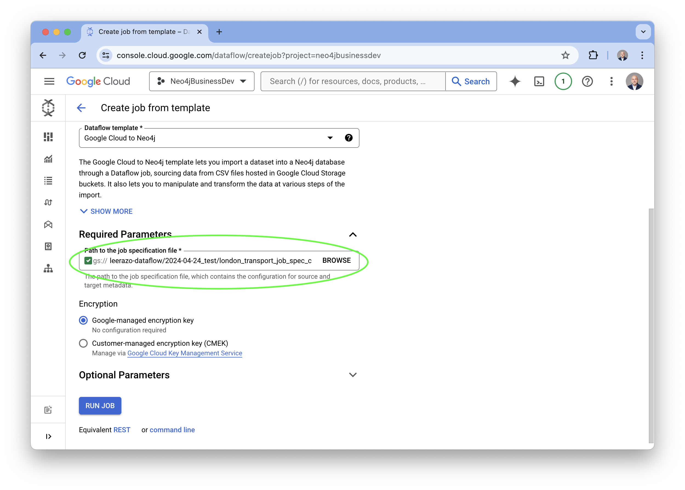

# Moving Data from a Google Cloud Storage bucket to Neo4j with Dataflow 

## Overview
In this section, we will set up a Dataflow job to extract and transform data from CSV files stored as objects in Google Cloud Storage and load them into a Neo4j graph database instance.

Documentation for this section can be found [here](https://neo4j.com/docs/dataflow-google-cloud/current/)

## Preparation
For this part of the lab you will need a Google Cloud Platform account with permission and access to deploy the following services:

1. Neo4j Aura: https://console.cloud.google.com/marketplace/product/endpoints/prod.n4gcp.neo4j.io
2. Cloud Storage: https://console.cloud.google.com/storage/
3. Dataflow: https://console.cloud.google.com/dataflow/

## Datasets
In this example we will use the [London public transport network](csv_files_for_gcs_to_neo4j/london_transport/) as our test dataset.

The template files we will use for this example are located [here](./templates/)

## Setup
### Preparing the source CSV files 
The data sources for this template need to be CSV files stored in Google Cloud Storage buckets.

CSV files must fulfill some constraints in order to be used as data sources for the Google Cloud to Neo4j template:

- they should not contain headers. Column names should be specified in the ordered_field_names attributes, and files should contain data rows only.

- they should not contain empty rows.

### Preparing the templates for Dataflow 

In order to deploy a Dataflow job for Neo4j you will need two JSON templates:


1. A __Dataflow job specification template__ which specifies the URI of the source files you've uploaded to Google Cloud Storage. This template will specify where to extract the data from and subsequently how to transform and load into our your graph data model in Neo4j. For this demo we will use [this job spec template](templates/london_transport_job_spec_custom_query_from_gcs.json). 

The template should refer to the Google Cloud Storage URI in the sources section using following format:

```
  "sources": [
    {
        "type": "text",
        "name": "tube_lines",
        "uri": "gs://neo4j-datasets/dataflow-london-transport/gcs-to-neo4j/source-data/London_tube_lines_no_headers.csv",
        "format": "EXCEL",
        "delimiter": ",",
        "ordered_field_names": "Tube_Line,From_Station,To_Station"
    }
```

You can refer to our [demo template](templates/london_transport_job_spec_custom_query_from_gcs.json) for reference or refer to our [online documentation](https://neo4j.com/docs/dataflow-google-cloud/current/) for more details.

[This notebook](notebook/neo4j_dataflow_bigquery.ipynb) will guide you through the steps of setting up a Google Cloud Storage bucket with the necessary template files uploaded to them. You can also do this step manually. 

2. A __Neo4j connnection template__. This template contans the login credentials for our Neo4j instance. There is a [sample connection template available here](templates/neo4j-connection_template.json.sample), but in general the format should look like this:

```
    {
        "server_url": "neo4j+s://<instance-id>.databases.neo4j.io",
        "database": "neo4j",
        "auth_type": "basic",
        "username": "neo4j",
        "pwd": "<password>"
    }
```

There is also a [helper Python script](../helper-scripts/neo4j_connection.pyhelper-scripts/neo4j_connection.py) available which can convert a Neo4j Aura credentials file into the correct JSON format. 

## Set up your Dataflow job

Once your template files are uploaded to the storage buckets you can continue on to configure and set up your Dataflow job. 

1. **Go to the Dataflow console**
- Select "Create New Job"
- Give your job a name and select the region


2. **Click on the dropdown menu and type "neo4j"**
- Select the "Google Cloud to Neo4j" template


3. **Configure Dataflow job specification template** 
- Browse to your storage bucket and select your job spec template



4. **Configure the Neo4j connection template** 
- Scroll down and open up the "Optional Parameters" section
- Fill in the location of the Neo4j connections template file or if you are using Google Secret Manager, enter the name of the Secret ID. 
- __NOTE: Although these two individual fields are "Optional", it is required to fill in one of them.__


5. **Scroll down to the bottom of the page and click "Run Job" and now wait for the job to finish (about 5-10 minutes for this demo)**


6. **The job is complete once all of the stages turn green and the job status field says "Succeeded".**


7. **Now you can log into the Neo4j instance and the graph is ready to explore!**


8. You can also explore the graph using __Neo4j Bloom__.

