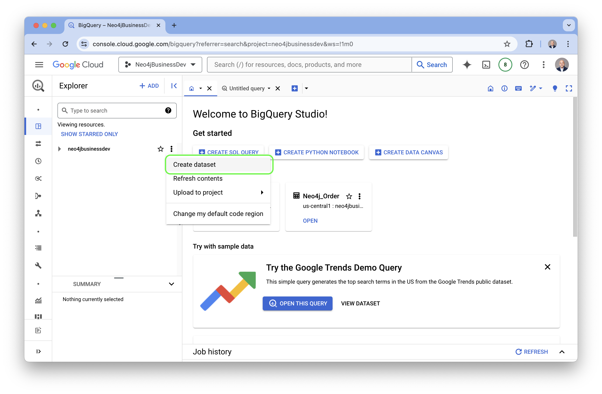
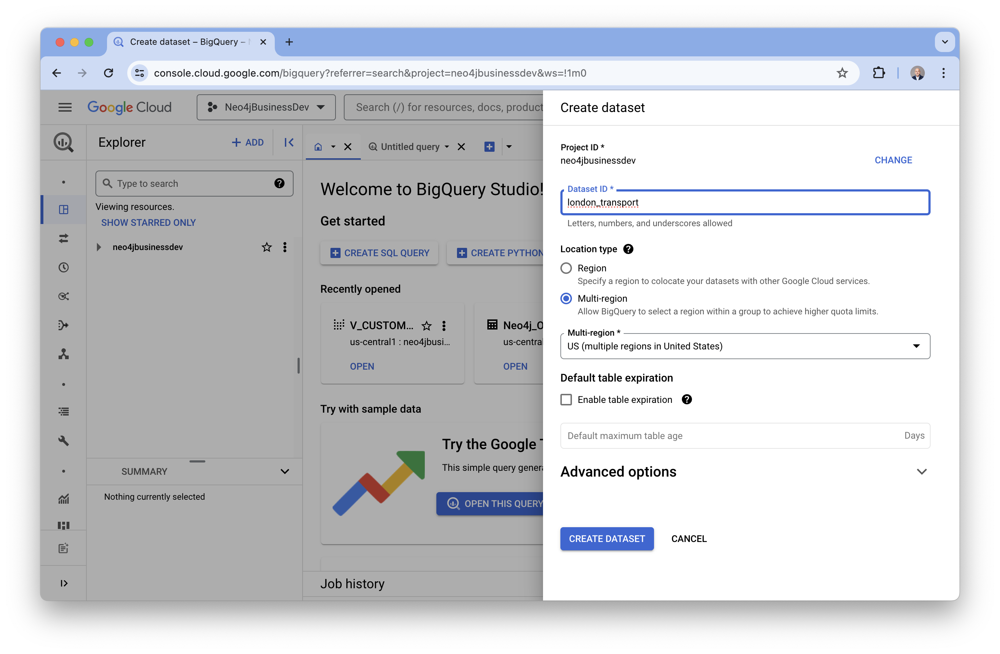
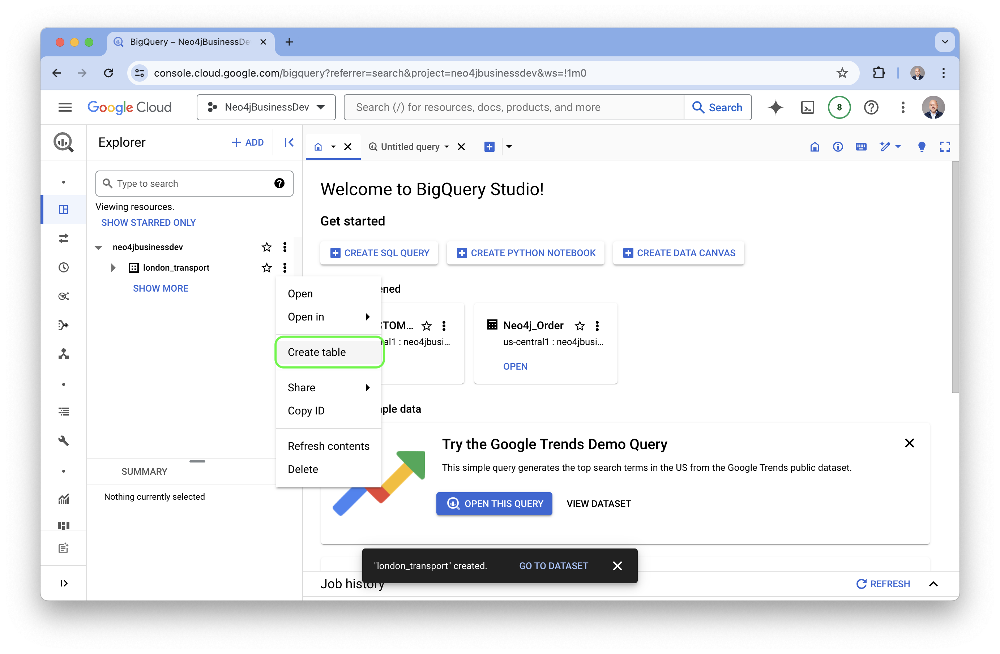
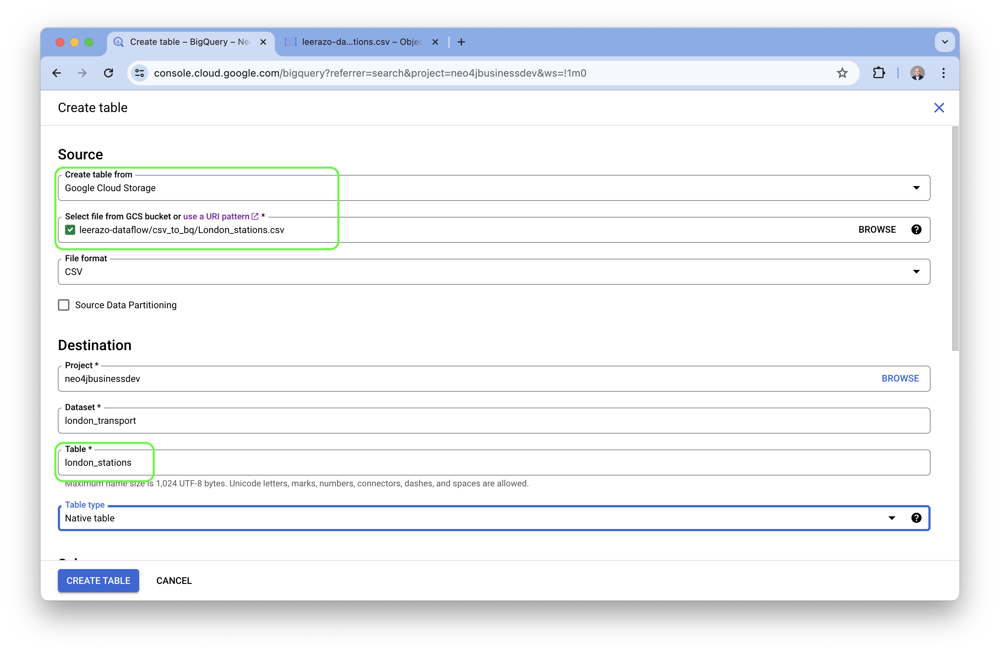
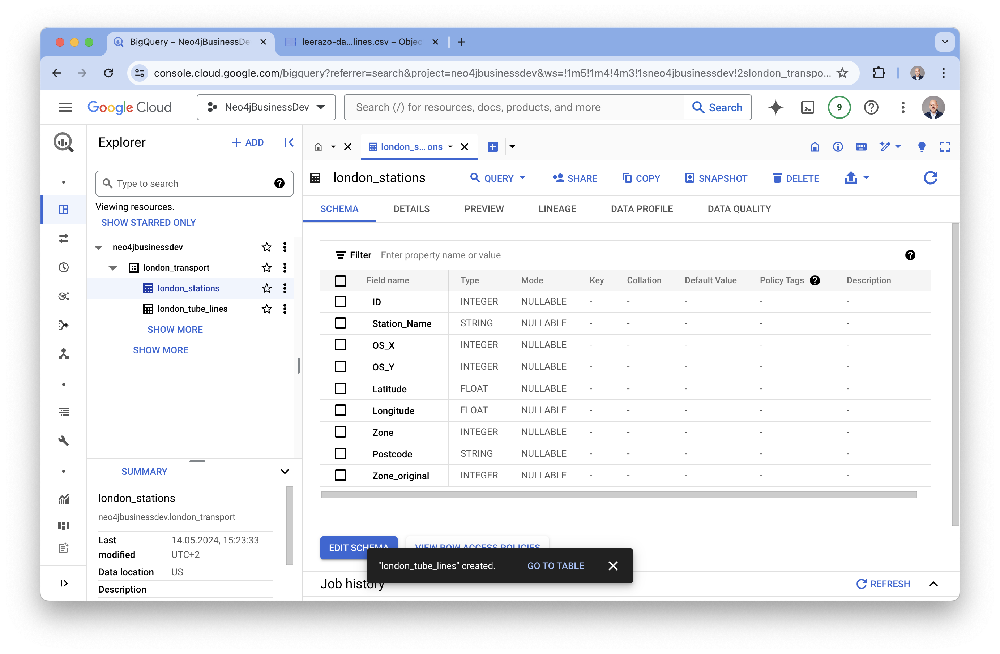
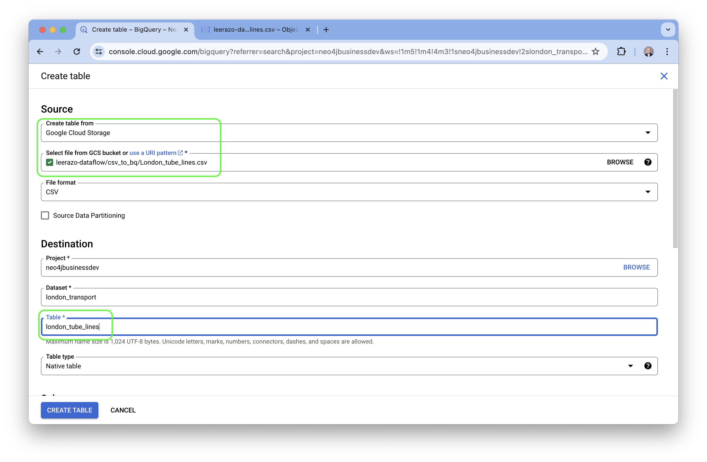
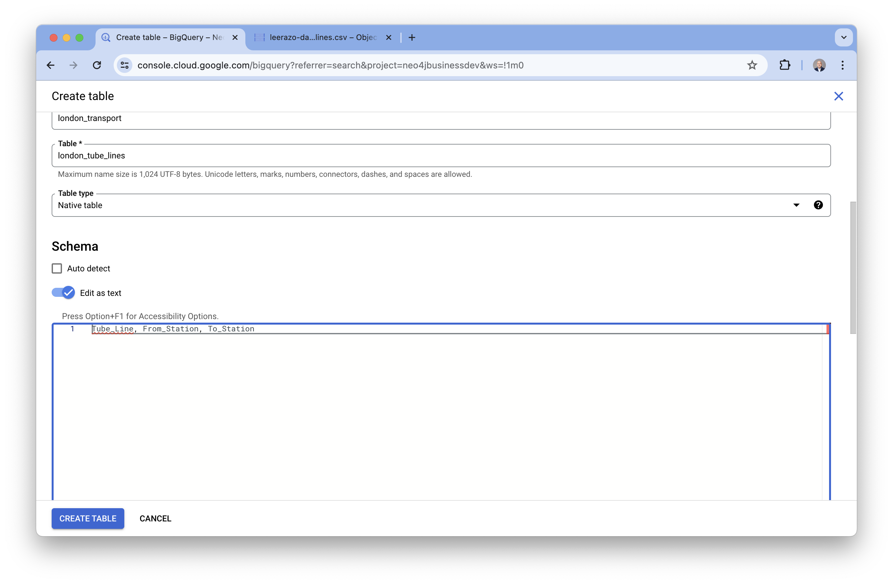
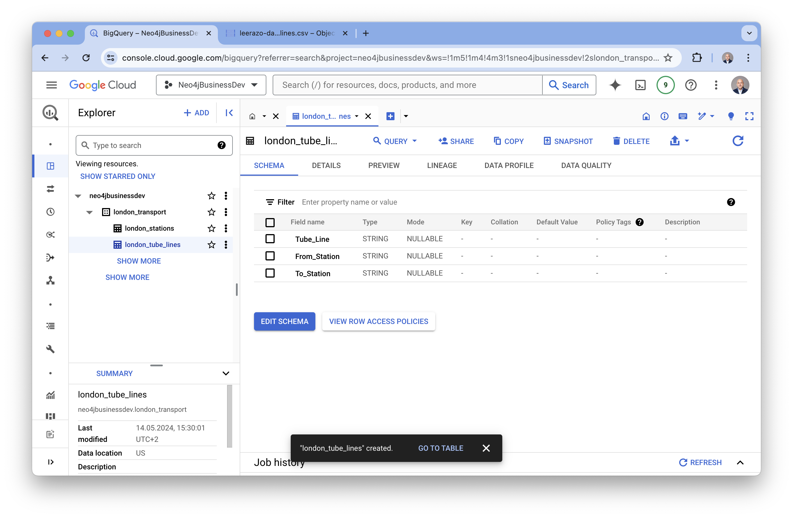
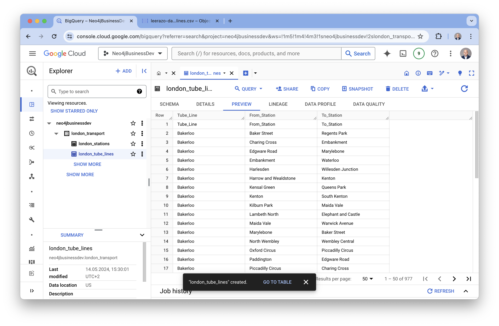

# Moving Data from a Google Cloud Storage bucket to Neo4j with Dataflow 

## Overview
In this section, we will set up a Dataflow job to extract and transform data from CSV files stored as objects in Google Cloud Storage and load them into a Neo4j graph database instance.

Documentation for this job specification template can be found [here](https://neo4j.com/docs/dataflow-google-cloud/current/). 

## Preparation
For this part of the lab you will need a Google Cloud Platform account with permission and access to deploy the following services:

1. Neo4j Aura: https://console.cloud.google.com/marketplace/product/endpoints/prod.n4gcp.neo4j.io
2. Cloud Storage: https://console.cloud.google.com/storage/
3. Dataflow: https://console.cloud.google.com/dataflow/

## Datasets
In this example we will use the [London public transport network](csv_files_for_gcs_to_neo4j/london_transport/) as our test dataset.

The template files we will use for this example are located [here](./templates/)

# Setup
## Prepare your template files

[This notebook](notebook/neo4j_dataflow_bigquery.ipynb) will guide you through the steps of setting up a Google Cloud Storage bucket with the necessary template files uploaded to them. 

You can also do this step manually. In order to deploy a Dataflow job for Neo4j you will need two JSON templates:

1. A Dataflow job specification template. This template specifies where and how data is extracted from the sources and subsequently transformed and loaded into our target graph model. For this demo we will use [this job spec template](datasets/templates/transport_for_london/london_transport_job_spec_custom_query.json). 

2. A Neo4j connnection template. This template contans the login credentials for our Neo4j instance. There is a [sample connection template available here](datasets/templates/neo4j-connection_template.json), but in general the format should look like this:

```
    {
        "server_url": "neo4j+s://XXXXXXXX.databases.neo4j.io",
        "database": "neo4j",
        "auth_type": "basic",
        "username": "neo4j",
        "pwd": "<password>"
    }
```

There is also a [helper Python script](helper-scripts/neo4j_connection.py) available which can convert a Neo4j Aura credentials file into the correct JSON format. 

## Uploading your templates and CSV files to Google Cloud Storage 

[ALL OF THE TEXT BELOW NEEDS TO BE UPDATED AND NEW SCREENSHOTS NEED TO BE MADE]

The [London_stations](./csv/London_stations.csv) file contains data about public transport stations in London such as Station_Name, Zone, Postcode, and location coordinates which we will use to create our graph. 

The [London_tube_lines](./csv/London_tube_lines.csv) file contains data we will use to determine the transit lines and connections between the stations. 

1. Create Dataset: Go to the [BigQuery console](https://console.cloud.google.com/bigquery)in Google Cloud and right click on the three dots to the right of your project name, select "Create Dataset"



2. Configure Dataset: Give the dataset a name, in this example we'll use *london_transport* for our dataset name.


3. Create london_stations table: Go to your dataset in the BigQuery console and right-click on the 3 dots to the right of the name. Select "Create table". 


4. Configure the london_stations table. Under "Source" select the dropdown menu under "Create table from" and select "Google Cloud Storage". 

In the next box you can either paste in the URI to the *London_stations.csv* file in your Google Cloud Storage bucket or you can select "BROWSE" to navigate and select it. 

Down below in the "Table" box give this table a name. In this example we'll use *london_stations* as the name of this table. 


Scroll down a bit further to the "Schema" section. For this table we can select "Auto detect" but there is also an option to edit the schema manually (we'll do this with the next table)

Once this is done, click the blue "Create Table" button on the bottom.


To confirm that everything was created correctly, go back to the BigQuery console, select your new table and click on the "Schema" and "Preview" tabs.




5. Configure the london_tube_lines table. Repeat steps 3 & 4 to come back to the table configuration screen. Once again select "Google Cloud Storage" as the data source and browse to or paste in the URI for the *London_tube_lines.csv* file in your cloud storage bucket. 

We'll name this table "london_tube_lines" for this example. 


Scroll down to the "Schema" section, this time we'll edit the schema manually. 

Select "Edit as text" and type or paste in the column headers separated by a comma under row 1:

```
Tube_Line,From_Station,To_Station
```

05b-edit_tube_lines_schema


Go back to the BigQuery console and select "Schema" and "Preview" on the newly created table to confirm.




## Set up your Dataflow job

Once your template files are uploaded to the storage buckets you can continue on to configure and set up your Dataflow job. 

1. **Go to the Dataflow console**
- Select "Create New Job"
- Give your job a name and select the region


2. **Click on the dropdown menu and type "neo4j"**
- Select the "Google Cloud to Neo4j" template


3. **Configure Dataflow job specification template** 
- Browse to your storage bucket and select your job spec template


4. **Configure the Neo4j connection template** 
- Scroll down and open up the "Optional Parameters" section
- Fill in the location of the Neo4j connections template file or if you are using Google Secret Manager, enter the name of the Secret ID. 
- __NOTE: Although these two individual fields are "Optional", it is required to fill in one of them.__


5. **Scroll down to the bottom of the page and click "Run Job" and now wait for the job to finish (about 5-10 minutes for this demo)**


6. **The job is complete once all of the stages turn green and the job status field says "Succeeded".**


7. **Now you can log into the Neo4j instance and the graph is ready to explore!**


8. You can also explore the graph using __Neo4j Bloom__.

