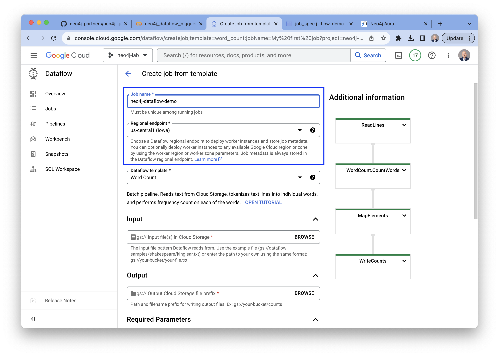
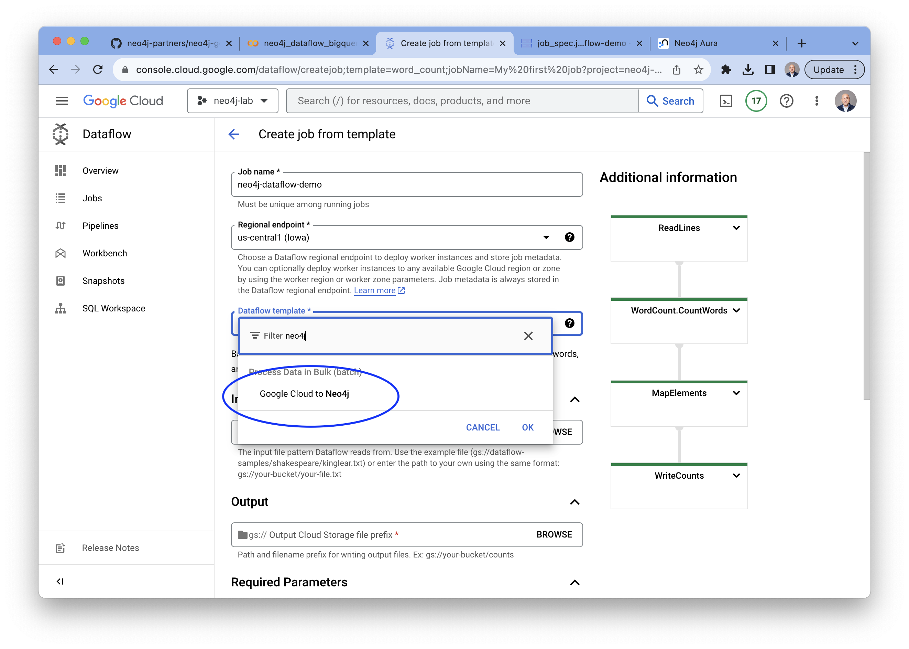
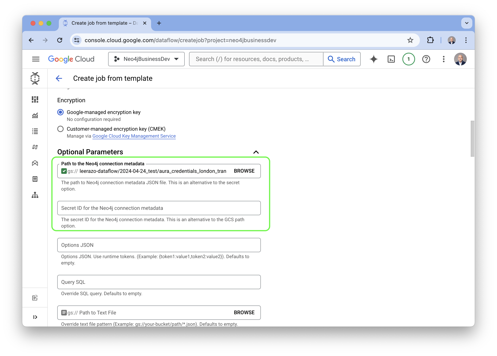

# neo4j-google-cloud-dataflow
Tutorial and resources for setting up Google Cloud Dataflow with Neo4j and BigQuery

# Overview
In this tutorial, you will learn how to set up Google Cloud Dataflow to extract, transform, and load data from Google BigQuery into a Neo4j graph database instance.

## Preparation
In order complete this lab you will need a Google Cloud Platform account with permission and access to deploy the following services:

1. Neo4j Aura: https://console.cloud.google.com/marketplace/product/endpoints/prod.n4gcp.neo4j.io
2. Cloud Storage: https://console.cloud.google.com/storage/
3. Dataflow: https://console.cloud.google.com/dataflow/
4. BigQuery: https://console.cloud.google.com/bigquery

## Datasets
There are some sample templates and demo datasets available in the [datasets directory](datasets/) of this repository.

In this example we will use the [London public transport network](datasets/csv_files/london_transport/) as our test dataset.

This is a cleaned up version of data downloaded from Transport for London represeting various stations in London and the connections between them. 

# Setup

## Deploy your Neo4j Instance

For this lab, we recommend deploying an instance of Aura from Google Cloud Platform. The links below will show you how to deploy an instance of AuraDS from Google Cloud Marketplace, however for this lab you can also deploy AuraDB Free. 

This [tutorial](https://github.com/neo4j-partners/hands-on-lab-neo4j-and-vertex-ai/tree/main/Lab%201%20-%20Deploy%20Neo4j#lab-1---deploy-neo4j) and [this video](https://youtu.be/27PMDtlSP4w) will guide you through the necessary steps. 

## Set up your Google Cloud project

1. [Select or create a Google Cloud project](https://console.cloud.google.com/cloud-resource-manager). When you first create an account, you get a $300 free credit towards your compute/storage costs.

1. [Make sure that billing is enabled for your project](https://cloud.google.com/billing/docs/how-to/modify-project).

1. [Enable the Dataflow API](https://console.cloud.google.com/apis/library/dataflow.googleapis.com).

1. [Enable the BigQuery API](https://console.cloud.google.com/apis/library/bigquery.googleapis.com).

1. If you are running this notebook locally, you will need to install the [Cloud SDK](https://cloud.google.com/sdk).

1. Enter your project ID in the cell below. Then run the cell to make sure the
Cloud SDK uses the right project for all the commands in this notebook.

## Prepare your template files

[This notebook](notebook/neo4j_dataflow_bigquery.ipynb) will guide you through the steps of setting up a Google Cloud Storage bucket with the necessary template files uploaded to them. 

## Set up your Dataflow job

Once your template files are uploaded to the storage buckets you can continue on to configure and set up your Dataflow job. 

1. **Go to the Dataflow console**
- Select "Create New Job"
- Give your job a name and select the region

2. **Click on the dropdown menu and type "neo4j"**
- Select the "Google Cloud to Neo4j" template

3. **Configure Dataflow job specification template** 
- Browse to your storage bucket and select your job spec template

4. **Configure the Neo4j connection template** 
- Scroll down and open up the "Optional Parameters" section
- Fill in the location of the Neo4j connections template file or if you are using Google Secret Manager, enter the name of the Secret ID. 
- __NOTE: Although these two individual fields are "Optional", it is required to fill in one of them.__

5. **Scroll down to the bottom of the page and click "Run Job" and now wait for the job to finish (about 5-10 minutes for this demo)**

6. **The job is complete once all of the stages turn green and the job status field says "Succeeded".**

7. **Now you can log into the Neo4j instance and the graph is ready to explore!**

8. You can also explore the graph using __Neo4j Bloom__.

